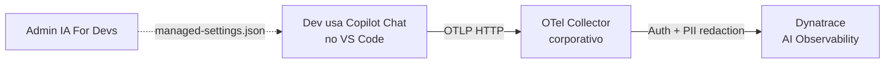

# IA For Devs × Dynatrace — Copilot AI Observability POC

Observabilidade em tempo real do **GitHub Copilot Chat** nas IDEs dos devs, com dados
fluindo para o **Dynatrace AI & LLM Observability**.

**Tenant:** `https://fov31014.apps.dynatrace.com`

> Repo público — colegas podem clonar, rodar e abrir PR. Ver [CONTRIBUTING.md](CONTRIBUTING.md).

## O que essa POC entrega

Cobre os 4 pilares que o cliente solicitou:

| Pilar | Cobertura | Detalhe |
|---|---|---|
| **FinOps (custo/tokens)** | ✅ Tempo real | Tokens exatos por interação, custo estimado por modelo |
| **Performance (SRE)** | ✅ Tempo real | Latência P50/P95/P99, time-to-first-token, timeouts |
| **Erros e limites** | ✅ Tempo real | HTTP 429, timeouts, falhas de tool call |
| **Adoção por dev** | ✅ Tempo real | Modelo por dev, conversation.id, git repo/branch |
| **Bônus: conteúdo** | 🔒 Opt-in | Prompt + resposta + tool arguments (requer aprovação LGPD) |
| **Bônus: qualidade** | 🧪 Opcional | LLM-as-judge sobre as respostas do Copilot via [dt-evals](https://github.com/dynatrace-oss/dt-evals) — ver [docs/07-evaluations.md](docs/07-evaluations.md) |

## Como funciona



O admin da IA For Devs publica `managed-settings.json` em uma das três formas:
1. **Server-managed** (GitHub Enterprise): arquivo em `.github-private/copilot/managed-settings.json`
2. **File-based**: arquivo colocado nas máquinas via MDM/Chef/Puppet/Ansible
3. **Native MDM**: Windows Registry ou macOS managed preferences via Intune

O VS Code de cada dev lê a configuração automaticamente e passa a emitir OTel para o
collector corporativo, que adiciona o token do Dynatrace e forwarda pro tenant.

## Estrutura do repositório

```
ia-observability-for-devs/
├── README.md                       (este arquivo)
├── docs/                           Documentação executiva e técnica
│   ├── 01-arquitetura.md           Fluxo de dados, decisões, componentes
│   ├── 02-admin-managed-settings.md  Como o admin da IA For Devs configura
│   ├── 03-dev-user-settings.md     Piloto: dev configura na própria máquina
│   ├── 04-lgpd-privacy.md          Considerações LGPD + captureContent
│   ├── 05-dql-queries.md           DQL para validar no Notebook
│   ├── 06-troubleshooting.md       Como debugar (console/file exporter)
│   └── 07-evaluations.md           Bônus: qualidade das respostas via dt-evals (LLM-as-judge)
├── collector/                      OTel Collector corporativo
│   ├── compose.yml                 Roda o collector via podman/docker
│   ├── otel-collector-config.yaml  Config: recebe OTLP, forwarda pro Dynatrace
│   └── .env.example                Variáveis: DT_TENANT, DT_INGEST_TOKEN
├── settings/                       Exemplos prontos de configuração
│   ├── user-settings.example.jsonc     Piloto: cada dev cola em seu VS Code
│   ├── workspace-settings.example.jsonc  Por projeto (opt-in do time)
│   └── managed-settings.example.json   Admin: coloca no .github-private ou MDM
├── dashboards/
│   └── copilot-chat-observability.json  Dashboard Dynatrace pronto pra importar
├── evals/                          dt-evals — LLM-as-judge sobre os spans do Copilot
│   ├── package.json                 Scripts npm (doctor, configure, run, run:ci)
│   ├── dt-eval.yaml.example         Config: métricas, judge provider, sampling
│   └── .env.example                 Variáveis: DT_API_TOKEN, chave do judge provider
├── CONTRIBUTING.md
└── .gitignore
```

## Quickstart (piloto de 1 dev)

O que o dev precisa fazer, resumido em 4 passos — a lista completa de settings (com
default, escopo e precedência entre managed/workspace/user) é a doc oficial da
Microsoft, não este repo: [VS Code — AI settings reference](https://code.visualstudio.com/docs/agents/reference/ai-settings).

1. Suba o collector localmente: `cd collector; podman-compose up -d`
2. Copie `.env.example` → `.env` e coloque seu `DT_INGEST_TOKEN`
3. Abra o `settings.json` **global** do seu usuário (não é o `.vscode/settings.json`
   do projeto) e cole o bloco do OTel no final, dentro das chaves `{ }` existentes.

   **Pelo VS Code** (mais fácil, funciona em qualquer OS):
   `Cmd+Shift+P` (macOS) ou `Ctrl+Shift+P` (Windows/Linux) → digite **Preferences:
   Open User Settings (JSON)** → Enter.

   **Direto pelo caminho do arquivo**, se preferir editar por fora:
   | OS | Caminho |
   |---|---|
   | macOS | `~/Library/Application Support/Code/User/settings.json` |
   | Linux | `~/.config/Code/User/settings.json` |
   | Windows | `%APPDATA%\Code\User\settings.json` |

   Cole no final do arquivo (mantendo o resto das suas settings intactas, igual ao
   exemplo em [settings/user-settings.example.jsonc](settings/user-settings.example.jsonc)):
   ```jsonc
   {
     // ...suas outras settings...,

     // ── OpenTelemetry — IA For Devs POC (Copilot Chat → Dynatrace) ──
     "github.copilot.chat.otel.enabled": true,
     "github.copilot.chat.otel.exporterType": "otlp-http",
     "github.copilot.chat.otel.otlpEndpoint": "http://localhost:4318",
     "github.copilot.chat.otel.captureContent": false,
     "github.copilot.chat.otel.maxAttributeSizeChars": 0
   }
   ```
4. Reload VS Code (`Cmd+Shift+P` → **Developer: Reload Window**) e use o Copilot Chat
   normalmente. Rode a DQL de [docs/05-dql-queries.md](docs/05-dql-queries.md) no
   Dynatrace pra confirmar.

Nada disso precisa ser feito de novo no rollout enterprise — o `managed-settings.json`
(Seção seguinte) sobrescreve essas mesmas chaves automaticamente para os 47 devs.

## Rollout enterprise (recomendado)

Ver [docs/02-admin-managed-settings.md](docs/02-admin-managed-settings.md).

## Referências oficiais

- [VS Code — Monitor agent usage with OpenTelemetry](https://code.visualstudio.com/docs/agents/guides/monitoring-agents)
- [VS Code — AI settings reference (managed/workspace/user, todas as chaves)](https://code.visualstudio.com/docs/agents/reference/ai-settings)
- [GitHub Changelog — Enterprise-managed OpenTelemetry export (08/jul/2026)](https://github.blog/changelog/2026-07-08-enterprise-managed-opentelemetry-export-for-vs-code-and-cli)
- [GitHub Changelog — Enterprise managed-settings.json GA (01/jul/2026)](https://github.blog/changelog/2026-07-01-enterprise-managed-settings-json-is-generally-available)
- [OTel GenAI Semantic Conventions](https://github.com/open-telemetry/semantic-conventions/blob/main/docs/gen-ai/)
- [dt-evals — LLM-as-judge para Dynatrace AI Observability](https://github.com/dynatrace-oss/dt-evals)
