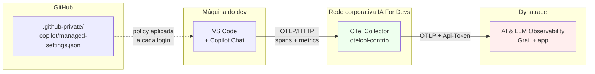

# Arquitetura da POC

## Visão geral

O objetivo é observar, em tempo real, **cada interação de Copilot Chat feita por qualquer dev**
da IA For Devs dentro do VS Code, e disponibilizar essa informação no Dynatrace AI
Observability app para análise por FinOps e SRE.

## Componentes



## Fluxo de dados detalhado

### 1. Emissão pelo VS Code Copilot Chat

Quando o dev interage com o Copilot Chat, a extensão gera uma árvore de spans OTel
seguindo as **OTel GenAI Semantic Conventions**:

```
invoke_agent copilot                    (~15s)  ← root span
  ├── chat gpt-4o                       (~3s)   ← LLM API call
  ├── execute_tool readFile             (~50ms)
  ├── execute_tool runCommand           (~2s)
  ├── chat gpt-4o                       (~4s)
  └── (span raiz encerra)
```

Cada span carrega atributos padronizados (`gen_ai.*`, `github.copilot.*`) que o
Dynatrace AI Observability já entende sem configuração adicional.

**Sem captureContent** (default): apenas metadados — modelo, tokens, latência, ferramentas usadas.

**Com captureContent=true**: também captura `gen_ai.input.messages`, `gen_ai.output.messages`,
`gen_ai.tool.call.arguments`, `gen_ai.tool.call.result`. Requer aprovação LGPD.

### 2. OTel Collector corporativo (recomendado)

O collector fica dentro da rede da IA For Devs e cumpre 3 funções:

1. **Concentrar autenticação** — o token de ingest do Dynatrace fica só no collector,
   não é distribuído para cada máquina de dev.
2. **PII redaction** (opcional) — se `captureContent=true`, o collector pode aplicar
   regex/hash em CPFs, emails, chaves API antes de forwardar.
3. **Enrichment** — adiciona atributos que o VS Code não conhece (dept, cost-center,
   sede corporativa) por lookup de user.email.

**Alternativa (menos segura):** apontar o VS Code direto ao Dynatrace via
`OTEL_EXPORTER_OTLP_HEADERS`. Funciona, mas obriga cada dev a ter o token, o que
aumenta a superfície de ataque e complica rotação.

### 3. Dynatrace

Recebe spans via `POST /api/v2/otlp/v1/traces` no endpoint `.live.dynatrace.com`.

- A app **AI & LLM Observability** detecta automaticamente pelo filtro
  `gen_ai.provider.name` + `llm.request.type in ("chat", "completion")`.
- Widgets prontos: Cost, Tokens, Latency, Errors, Prompts (se captureContent=true).
- DQL customizado disponível no Notebook.

## Deployment do managed-settings.json

Três canais suportados (precedência do maior para o menor):

| Canal | Quando usar | Prós | Contras |
|---|---|---|---|
| **Native MDM** (Intune / Jamf / GPO) | Frotas Windows/macOS gerenciadas por MDM | Aplicação garantida, políticas centralizadas | Requer stack de MDM operante |
| **Server-managed** (`.github-private/copilot/managed-settings.json`) | GitHub Enterprise Cloud com AI Controls | Segue o dev entre máquinas, atualização hourly automática | Só GHEC, não GHES |
| **File-based** (`/etc/github-copilot/managed-settings.json`) | Deploy via Chef/Puppet/Ansible | Não depende de MDM nem GHEC | Precisa de config-mgmt em todos os hosts |

**Recomendação IA For Devs:** começar com **File-based via Ansible** para o piloto (3-5 devs),
migrar para **Server-managed** ou **Native MDM** no rollout completo.

## Segurança e Privacidade

### Segurança do token Dynatrace

- **Token fica só no collector**, dentro da rede. Nunca sai pra máquina de dev.
- Rotação: trocar no collector → todas as máquinas passam a usar o novo token
  imediatamente na próxima span.
- Escopo mínimo: `openTelemetryTrace.ingest` + `metrics.ingest`. Nada mais.

### Segurança do canal VS Code → Collector

- Se collector expuser porta 4318 (OTLP HTTP) publicamente: **NÃO faça isso**.
- Se collector está na rede interna: sem auth adicional é aceitável, VS Code do dev
  já é autenticado na rede corporativa (VPN/Zscaler/etc).
- Se precisa auth: usar mTLS via `OTEL_EXPORTER_OTLP_CERTIFICATE` distribuído
  como managed setting.

### LGPD e captureContent

Ver [04-lgpd-privacy.md](04-lgpd-privacy.md). Resumo:

- **captureContent=false** (default): sem risco de PII/código proprietário.
- **captureContent=true**: obriga aprovação jurídica + comunicação transparente aos devs.

## O que essa arquitetura NÃO cobre

Deixando explícito o que fica fora do escopo:

- **Autocomplete inline** (sugestões enquanto o dev digita) — GitHub ainda não emite OTel.
- **JetBrains, Visual Studio, Neovim** — o pacote OTel só está no VS Code Chat extension.
- **Copilot na web (github.com/copilot)** — sem OTel.
- **Uso do Copilot em outras orgs GitHub não gerenciadas pela IA For Devs** — VS Code
  do dev logado em conta pessoal ignora managed settings da empresa.

Para esses gaps, complementar com a **Copilot Usage Metrics API** do GitHub (dados
agregados diários) — mas isso fica fora desta POC.
