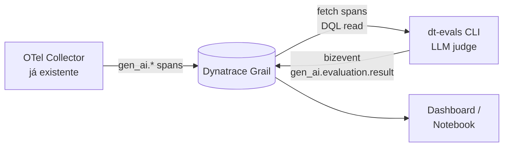

# Evaluations — qualidade das respostas do Copilot (dt-evals)

Os pilares anteriores (FinOps, SRE, Adoção) respondem "quanto custou" e "quão rápido
foi". Este documento cobre um quinto pilar, opcional: **a resposta do Copilot foi boa?**

Isso é feito com [`dt-evals`](https://github.com/dynatrace-oss/dt-evals), toolkit
open-source da Dynatrace que roda um **LLM-as-judge** sobre os spans `gen_ai.*` já
capturados por este projeto e grava o resultado de volta no Dynatrace como bizevent.
Não precisa trocar nada na captura do Copilot — ele lê os spans que o coletor já
está recebendo (ver [01-arquitetura.md](01-arquitetura.md)).

Dashboard de referência (dados de exemplo, tenant público da Dynatrace):
https://wkf10640.apps.dynatrace.com/ui/apps/dynatrace.dashboards/dashboard/monaco-2cf9a79b-8b32-3244-aed1-e9d8c6e3e6a8

## Como funciona



`dt-evals` não fica no caminho do Copilot Chat: ele roda **fora**, sob demanda ou
agendado, lendo spans recentes via DQL e escrevendo os scores como bizevents.

## Setup (já pronto na pasta `evals/`)

Este repo já traz o scaffold em [`evals/`](../evals) — não precisa instalar nada global.
Requer Node.js ≥20 e um judge provider (OpenAI, Anthropic, Google, Bedrock ou Azure
OpenAI); qualquer um funciona, escolha o que a Boa Vista já aprovou internamente.

```bash
cd evals
npm install                        # instala @dynatrace-oss/dt-evals localmente
cp dt-eval.yaml.example dt-eval.yaml   # ajuste provider/model/métricas se precisar
cp .env.example .env                   # preencha DT_API_TOKEN + a API key do judge

npm run doctor      # valida Node, credenciais e permissões (cria o token se faltar)
npm run validate    # confere schema do dt-eval.yaml + conectividade
npm run run:dry      # simula sem chamar o judge nem gravar nada — bom pro primeiro teste
npm run run          # roda de verdade e grava os scores como bizevent no Dynatrace
```

`dt-eval.yaml` e `.env` ficam **fora do git** (ver `.gitignore`) — cada colega usa o
próprio token/API key, nunca commitar credencial real. `dt-eval.yaml.example` e
`.env.example` são os templates versionados.

O token do Dynatrace usado pelo `dt-evals` é **diferente** do `DT_INGEST_TOKEN` do
collector (ver [06-troubleshooting.md](06-troubleshooting.md)): precisa de escopos de
leitura de spans e leitura/escrita de bizevents — `npm run doctor` já orienta a criar
o token com o escopo certo (`storage:spans:read`, `storage:events:read`,
`storage:events:write`).

Métricas já habilitadas no `dt-eval.yaml.example` (lista completa com
`npx dt-evals evaluators list`, 14 built-ins disponíveis):

| Métrica | O que mede |
|---|---|
| `relevance` | resposta responde o que foi perguntado |
| `faithfulness` | resposta não inventa nada fora do contexto fornecido |
| `user-frustration` | sinais de frustração do dev na conversa (score binário) |

Para rodar continuamente em vez de manual: `npx dt-evals schedule add` ou `npx
dt-evals deploy --provider aws|gcp|azure` (empacota como Lambda/Cloud Run/Function) —
ver [README do dt-evals](https://github.com/dynatrace-oss/dt-evals) para detalhes.

## Schema do evento gravado no Dynatrace

Cada avaliação vira um bizevent `gen_ai.evaluation.result`, com estes campos (são os
mesmos usados pelos filtros do dashboard `dt-evals`: Service, Provider, JudgeModel,
Metric, EvalType, ScoreLabel, RunId):

| Campo no evento | Filtro no dashboard | Exemplo |
|---|---|---|
| `dt.service.name` | Service | `copilot-chat` |
| `gen_ai.provider.name` | Provider | `openai` (provider do **judge**, não do Copilot) |
| `gen_ai.request.model` | JudgeModel | `gpt-4.1` |
| `gen_ai.evaluation.name` | Metric | `faithfulness`, `relevance`, `user-frustration` |
| `gen_ai.evaluation.type` | EvalType | `ready_made` ou `custom` |
| `gen_ai.evaluation.score.label` | ScoreLabel | `pass` / `fail` |
| `dt.eval.run_id` | RunId | id do batch de `dt-evals run` |
| `gen_ai.evaluation.score.value` | — | número (0–1, 0–5, 0–10 ou 0–100 conforme `scoring_format`) |
| `trace_id` / `span_id` | — | permite clicar do score direto para o trace original do Copilot |

## DQL — validação e análises

Rode no Notebook do tenant, igual às queries de [05-dql-queries.md](05-dql-queries.md).

### Sanity check — evals estão chegando?

```dql
fetch bizevents, from:now()-24h
| filter event.type == "gen_ai.evaluation.result"
| summarize count = count() by gen_ai.evaluation.name, gen_ai.evaluation.score.label
```

### Score médio por métrica (últimas 24h)

```dql
fetch bizevents, from:now()-24h
| filter event.type == "gen_ai.evaluation.result"
| summarize avg_score = avg(gen_ai.evaluation.score.value),
            evaluations = count(),
            pass_rate = countIf(gen_ai.evaluation.score.label == "pass") * 100.0 / count()
  by gen_ai.evaluation.name
| sort avg_score asc
```

### Taxa de falha por modelo do Copilot avaliado

Junta os scores (bizevents) com o span original do Copilot (via `trace_id`) para saber
**qual modelo do Copilot** gerou as respostas reprovadas — não confundir com
`gen_ai.request.model` do bizevent, que aqui é o modelo do *judge*.

```dql
fetch bizevents, from:now()-24h
| filter event.type == "gen_ai.evaluation.result"
| filter isNotNull(trace_id)
| join [
    fetch spans, from:now()-24h
    | filter gen_ai.provider.name == "github" and span.name == "chat"
    | fields trace_id, copilot_model = gen_ai.request.model
  ], on:{trace_id}, kind:leftOuter
| summarize evaluations = count(),
            fails = countIf(gen_ai.evaluation.score.label == "fail")
  by copilot_model, gen_ai.evaluation.name
| fieldsAdd fail_rate = round(toDouble(fails) / toDouble(evaluations) * 100, 1)
| sort fail_rate desc
```

### Drift — score ao longo do tempo por run

```dql
timeseries avg_score = avg(gen_ai.evaluation.score.value),
  by:{gen_ai.evaluation.name}, from:now()-7d, interval:1h,
  filter:{event.type == "gen_ai.evaluation.result"}
```

## LGPD

`dt-evals` lê o `input`/`output` do span para mandar ao judge, mas isso só existe se
`captureContent=true` estiver habilitado no Copilot (ver
[04-lgpd-privacy.md](04-lgpd-privacy.md)). Sem `captureContent`, os evaluators que
dependem de texto completo (ex: `faithfulness`, que compara resposta com contexto)
não têm o que avaliar — rodam vazio ou pulam o span. Métricas baseadas só em
metadados (latência, uso de ferramentas) continuam funcionando normalmente.

## Referência

- [dt-evals no GitHub](https://github.com/dynatrace-oss/dt-evals)
- [Post da comunidade Dynatrace](https://community.dynatrace.com/t5/Open-Source/dt-evals-an-open-source-continuous-evaluation-tool-for-LLM-apps/ba-p/300057)
