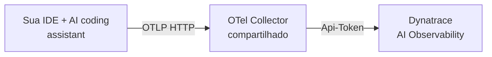

# Getting Started — conectando ao OTel Collector compartilhado

Este guia é para quando **já existe um OTel Collector rodando** (provisionado pelo time
de plataforma ou por você mesmo, ver [collector/](../collector)) e você só precisa
apontar sua IDE pra ele. Nenhum passo aqui depende de qual ferramenta de IA você usa —
GitHub Copilot Chat, Claude Code, Cursor ou qualquer outro client que siga as
[OTel GenAI Semantic Conventions](https://github.com/open-telemetry/semantic-conventions/blob/main/docs/gen-ai/)
emite os mesmos spans (`gen_ai.*`) e chega no Dynatrace do mesmo jeito.

**A ideia em uma frase:** sua IDE emite OTel → o collector recebe, autentica e
repassa → o Dynatrace enxerga isso automaticamente no app **AI Observability**.



> Troque `<OTEL_COLLECTOR_HOST>` pelo endereço real fornecido pelo time de plataforma
> em todos os passos abaixo. Não commite o endereço/IP real em repositórios públicos —
> mantenha-o em configuração local (`.env`, settings pessoais) ou em um DNS interno
> (ex.: `otel-collector.seudominio.internal`).

---

## Passo 1 — VS Code User Settings

`Cmd+Shift+P` (macOS) ou `Ctrl+Shift+P` (Windows/Linux) → **"Preferences: Open User
Settings (JSON)"** → adicione dentro das chaves `{ }` existentes:

```jsonc
"github.copilot.chat.otel.enabled": true,
"github.copilot.chat.otel.exporterType": "otlp-http",
"github.copilot.chat.otel.otlpEndpoint": "http://<OTEL_COLLECTOR_HOST>:4318",
"github.copilot.chat.otel.captureContent": false
```

`captureContent: false` mantém a captura só em metadados (modelo, tokens, latência) —
sem prompt/resposta/código. Ver [04-lgpd-privacy.md](04-lgpd-privacy.md) antes de mudar isso.

## Passo 2 — Identidade do dev (`~/.zprofile`)

Essas variáveis são o que permite o Dynatrace saber **quem** gerou cada span — sem
elas, os dashboards de custo/adoção por dev ficam vazios. Abra o Terminal e rode
(trocando o e-mail e o `team.id` pelos seus):

```bash
cat >> ~/.zprofile << 'EOF'

# AI coding assistant OTEL → Dynatrace
export COPILOT_OTEL_ENABLED="true"
export OTEL_SERVICE_NAME="github-copilot-chat"
export OTEL_RESOURCE_ATTRIBUTES="user.email=SEU_EMAIL@dominio.com,host.name=$(hostname -s),team.id=seu-time,deployment.environment=lab"
EOF
```

`OTEL_SERVICE_NAME` identifica a ferramenta (troque se não for Copilot — ex.
`claude-code`, `cursor`). `deployment.environment` separa lab/piloto de produção nos
filtros do Dynatrace.

## Passo 3 — Reabrir o VS Code pelo terminal

As variáveis do `~/.zprofile` só são lidas por processos **novos**. Feche o VS Code
completamente (`Cmd+Q`) e reabra por um terminal que já carregou o profile:

```bash
source ~/.zprofile && code .
```

## Passo 4 — Confirmar no Output do VS Code

`View → Output` → dropdown **"GitHub Copilot Chat"**. Deve aparecer algo como:

```
[OTel] Instrumentation enabled — exporter=otlp-http endpoint=http://<OTEL_COLLECTOR_HOST>:4318/
```

Se não aparecer, ver [06-troubleshooting.md](06-troubleshooting.md).

---

## Validando no Dynatrace

Use o Copilot Chat (ou sua ferramenta de IA) normalmente por alguns minutos, depois
rode no Notebook do tenant. Todas as queries abaixo são **agnósticas de modelo e de
ferramenta** — filtram por `isNotNull(gen_ai.request.model)`, que qualquer client
compatível com OTel GenAI Semantic Conventions preenche, em vez de travar em
`service.name == "copilot-chat"`. Se você quiser ver só uma ferramenta específica,
adicione `and service.name == "nome-do-serviço"`.

### 🩺 Sanity check — os spans estão chegando?

```dql
fetch spans, from:now()-1h
| filter isNotNull(gen_ai.request.model)
| summarize spans = count(), devs = countDistinct(user.email), by:{service.name, gen_ai.agent.name}
| sort spans desc
```

### 📊 Volume — chats vs execuções de tool (24h)

```dql
fetch spans, from:now()-24h
| filter isNotNull(gen_ai.request.model)
| summarize chats = countIf(startsWith(span.name, "chat ")),
            tools = countIf(startsWith(span.name, "execute_tool ")),
            sessions = countDistinct(gen_ai.conversation.id)
```

### 💰 FinOps — custo total por modelo (24h)

> Pricing hardcoded como estimativa — ajuste conforme seu contrato real.

```dql
fetch spans, from:now()-24h
| filter isNotNull(gen_ai.usage.input_tokens)
| fieldsAdd inp = toDouble(gen_ai.usage.input_tokens)
| fieldsAdd out = toDouble(gen_ai.usage.output_tokens)
| fieldsAdd cost_usd =
    if(contains(gen_ai.request.model, "opus"),
       (inp * 0.000015) + (out * 0.000075),
    else: if(contains(gen_ai.request.model, "mini"),
       (inp * 0.00000015) + (out * 0.0000006),
    else: if(contains(gen_ai.request.model, "claude"),
       (inp * 0.000003) + (out * 0.000015),
    else: if(contains(gen_ai.request.model, "gpt-4o"),
       (inp * 0.0000025) + (out * 0.00001),
    else: (inp * 0.000002) + (out * 0.00001)))))
| summarize total_cost = sum(cost_usd),
            input_tokens = sum(inp),
            output_tokens = sum(out),
            requests = count(),
            by:{gen_ai.request.model}
| sort total_cost desc
```

### 💰 Custo por dev (top 20)

```dql
fetch spans, from:now()-24h
| filter isNotNull(user.email) and isNotNull(gen_ai.usage.input_tokens)
| fieldsAdd inp = toDouble(gen_ai.usage.input_tokens)
| fieldsAdd out = toDouble(gen_ai.usage.output_tokens)
| fieldsAdd cost_usd =
    if(contains(gen_ai.request.model, "opus"),
       (inp * 0.000015) + (out * 0.000075),
    else: if(contains(gen_ai.request.model, "mini"),
       (inp * 0.00000015) + (out * 0.0000006),
    else: if(contains(gen_ai.request.model, "claude"),
       (inp * 0.000003) + (out * 0.000015),
    else: (inp * 0.0000025) + (out * 0.00001))))
| summarize cost_usd = sum(cost_usd),
            tokens = sum(inp + out),
            chats = count(),
            by:{user.email, user.name, user.team}
| sort cost_usd desc
| limit 20
```

### 💰 Custo por time (7 dias)

```dql
fetch spans, from:now()-7d
| filter isNotNull(user.team) and isNotNull(gen_ai.usage.input_tokens)
| fieldsAdd inp = toDouble(gen_ai.usage.input_tokens)
| fieldsAdd out = toDouble(gen_ai.usage.output_tokens)
| fieldsAdd cost_usd =
    if(contains(gen_ai.request.model, "opus"),
       (inp * 0.000015) + (out * 0.000075),
    else: if(contains(gen_ai.request.model, "mini"),
       (inp * 0.00000015) + (out * 0.0000006),
    else: (inp * 0.0000025) + (out * 0.00001)))
| summarize cost_usd = sum(cost_usd),
            devs = countDistinct(user.email),
            chats = count(),
            by:{user.team}
| sort cost_usd desc
```

### ⚙️ SRE — latência P50/P95/P99 por modelo (24h)

```dql
fetch spans, from:now()-24h
| filter isNotNull(gen_ai.request.model)
| filter startsWith(span.name, "chat ")
| fieldsAdd dur_ms = duration / 1000000
| summarize p50 = percentile(dur_ms, 50),
            p95 = percentile(dur_ms, 95),
            p99 = percentile(dur_ms, 99),
            avg_ms = avg(dur_ms),
            requests = count(),
            by:{gen_ai.request.model}
| sort p95 desc
```

### 🎯 Adoção — modelos mais usados (7 dias)

```dql
fetch spans, from:now()-7d
| filter isNotNull(gen_ai.request.model)
| filter startsWith(span.name, "chat ")
| summarize chats = count(),
            devs = countDistinct(user.email),
            tokens = sum(toLong(gen_ai.usage.input_tokens) + toLong(gen_ai.usage.output_tokens)),
            by:{gen_ai.request.model}
| sort chats desc
```

### 🕸️ Agents / sub-agents ativos (24h)

```dql
fetch spans, from:now()-24h
| filter isNotNull(gen_ai.agent.name)
| summarize chats = count(),
            tokens = sum(toLong(gen_ai.usage.input_tokens) + toLong(gen_ai.usage.output_tokens)),
            by:{gen_ai.agent.name}
| sort chats desc
```

### 🏆 Top 10 devs por consumo (7 dias)

```dql
fetch spans, from:now()-7d
| filter isNotNull(gen_ai.request.model)
| filter startsWith(span.name, "chat ")
| filter isNotNull(user.email)
| summarize chats = count(),
            tokens = sum(toLong(gen_ai.usage.input_tokens) + toLong(gen_ai.usage.output_tokens)),
            sessions = countDistinct(gen_ai.conversation.id),
            by:{user.email, user.name, user.team}
| sort chats desc
| limit 10
```

### 🧵 Sessões — top conversas por consumo (24h)

```dql
fetch spans, from:now()-24h
| filter isNotNull(gen_ai.conversation.id)
| summarize chats = count(),
            total_tokens = sum(toLong(gen_ai.usage.input_tokens) + toLong(gen_ai.usage.output_tokens)),
            by:{gen_ai.conversation.id, user.email}
| sort total_tokens desc
| limit 10
```

---

## Correlacionando com o app AI Observability

As queries acima são o caminho "manual" (Notebook/DQL). O mesmo dado já aparece
**automaticamente** — sem nenhuma configuração adicional — no app nativo
**AI Observability** do Dynatrace, porque os spans seguem as OTel GenAI Semantic
Conventions. Onde procurar cada coisa:

| O que você quer ver | Onde no app AI Observability | Equivalente DQL acima |
|---|---|---|
| Serviços/modelos/providers detectados automaticamente | **Overview** | Sanity check |
| Latência, taxa de erro, saúde do serviço `copilot-chat` | **Service Health** | Latência P50/P95/P99 |
| Conversas completas (prompt + resposta, se `captureContent=true`) | **Prompts** | — |
| Topologia de agentes/sub-agentes e qual modelo cada um chama | **Agents topology** | Agents / sub-agents ativos |
| Scores de qualidade do `dt-evals` | **Evaluations** | Ver [07-evaluations.md](07-evaluations.md) |

Use o app nativo pro dia a dia (drill-down visual, clique até o trace) e o Notebook/DQL
pra análises específicas ou pra alimentar o dashboard
[developers-ai-usage.json](../dashboards/developers-ai-usage.json).

## Próximos passos

- Import [dashboards/developers-ai-usage.json](../dashboards/developers-ai-usage.json) no Dynatrace.
- Se ainda não tem um collector compartilhado, suba um: [collector/](../collector) + [01-arquitetura.md](01-arquitetura.md).
- Rollout pra mais devs sem repetir esses passos manualmente: [02-admin-managed-settings.md](02-admin-managed-settings.md).
